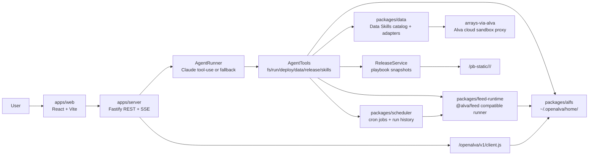
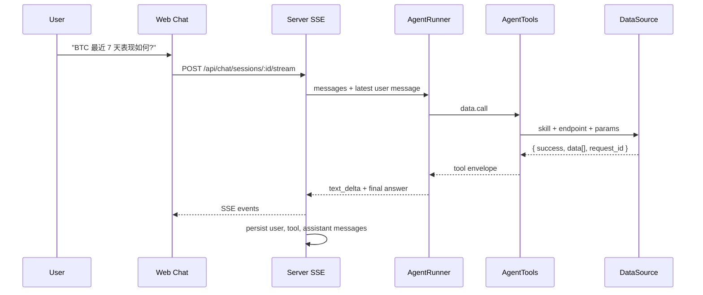
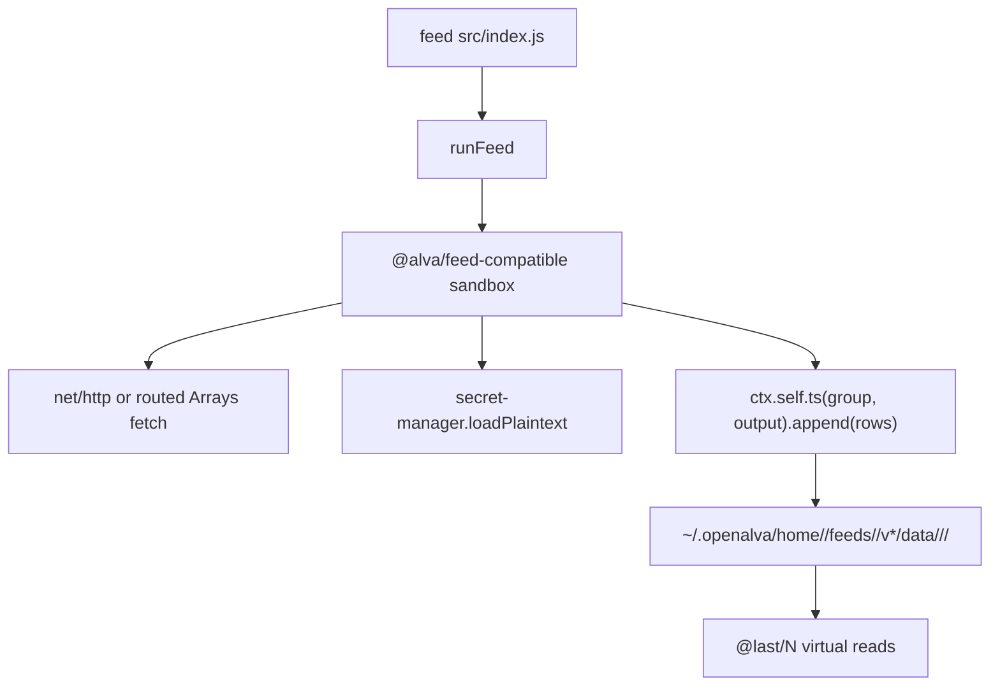
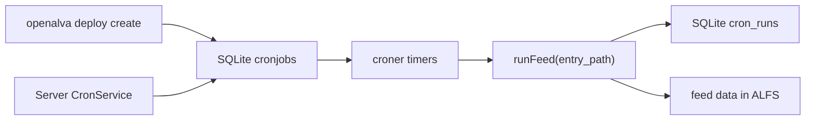
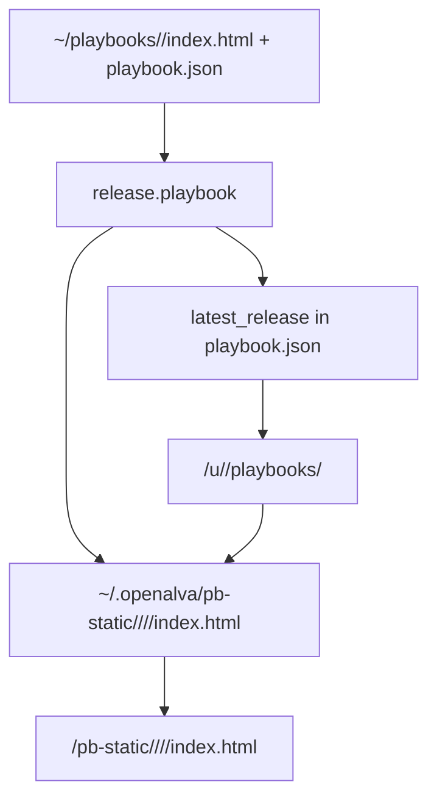

# OpenAlva

English | [中文](./README.md)

OpenAlva is a local-first, open-source recreation of the core Alva product idea: a conversational financial agent that can answer market questions with live tools, build persistent financial workflows, run scheduled feeds, and publish versioned playbook pages on localhost.

The project is intentionally not a Claude Code or Codex wrapper. Claude Code and Codex are coding agents that operate over a repository. OpenAlva is an application runtime: it has its own web UI, filesystem model, feed runtime, data-source layer, scheduler, release system, and browser SDK. A model is only one replaceable component inside the product.

> Current status: the core Phase 0-4 loop is now in place: Chat/Agent tool use, ALFS/feed runtime, cron scheduling, release/lint/screenshot, Explore, artifact publishing, UDFs, local notifications, and `@alva/pi`. Phase 5 now includes the `seed.portfolioWatch` compatibility entry point, which can generate and publish a Portfolio-Watch seed playbook. Next work focuses on 2-3 named portfolio templates, Altra-lite, Remix, and native data drivers.

## Why OpenAlva Exists

Alva popularized a useful product shape for investors:

1. Ask an agent for a market view.
2. The agent fetches real data instead of relying on memory.
3. If the workflow should persist, the agent creates feed code and a playbook.
4. Feeds refresh on a schedule.
5. A published HTML page reads the latest feed data and stays available locally.
6. Published playbooks can later be remixed or evolved.

OpenAlva brings that shape into a local, self-owned system:

- Files and data live under `~/.openalva`.
- The product can run on one machine.
- Data-source adapters can be replaced over time.
- The LLM backend can be swapped.
- Playbook artifacts remain local files, not opaque hosted state.

## Architecture At A Glance



### Monorepo Layout

```text
apps/server
  Fastify server: health, design-system hosting, chat SSE, tools API,
  playbook live/static routes, minimal browser SDK.

apps/web
  React + Vite host UI: sidebar, chat page, session list, SSE handling,
  tool execution cards, model selector placeholder.

packages/alfs
  Local ALFS-compatible filesystem layer. Resolves ~/... to
  ~/.openalva/home/<user>/..., supports @last/N virtual reads,
  time-series buckets, @kv, and single-machine grant stubs.

packages/feed-runtime
  @alva/feed-compatible runtime. Runs feed scripts, exposes a whitelisted
  module surface, writes feed outputs through ALFS time-series APIs.

packages/scheduler
  Cron storage and execution service for deploy create/list/get/pause/
  resume/delete/trigger/runs.

packages/data
  Mirrored Data Skills catalog plus DataSource adapters. The current P0
  adapter is arrays-via-alva, which executes fetch code through the Alva
  cloud sandbox so public endpoints can work without storing a real
  Arrays JWT locally.

packages/cli
  openalva CLI subset for fs, run, and deploy operations.

vendor/design-system
  Vendored Alva design tokens, design-system CSS, and design contract.
```

## How It Differs From Claude Code Or Codex

Claude Code and Codex are general coding agents. They inspect a repository, edit files, run commands, and help with software development.

OpenAlva is a domain application that uses an agent internally.

| Dimension | Claude Code / Codex | OpenAlva |
|---|---|---|
| Primary user goal | Modify or understand code | Build and run financial workflows |
| Main surface | CLI/editor/chat over a repo | Product web UI with chat, playbooks, releases |
| Persistence model | Git files and working tree | ALFS home tree, feed data, SQLite metadata, release snapshots |
| Tooling | Shell, file edits, tests, repo actions | `fs`, `run`, `deploy`, `data.call`, `release`, skills, browser SDK |
| Runtime output | Code changes, commits, PRs | Scheduled data feeds and live localhost playbook pages |
| Data policy | Depends on the coding task | Market facts must be fetched via tools, not model memory |
| UX target | Developer workflow | Investor/builder workflow |
| Agent role | The product itself | One replaceable component inside the product |

In short: Codex can help build OpenAlva. OpenAlva is the financial workflow runtime that an investor uses after it exists.

## Core Data Flow

### 1. One-Off Market Question



Market-sensitive answers are expected to go through `data.call` or another relevant tool. The model should not invent current prices, returns, rates, or other time-sensitive facts.

### 2. Feed Execution



Important ALFS/feed semantics:

- `ts(group, output).append(rows)` replaces the entire bucket for the same `date`.
- Different `date` buckets coexist.
- `@last/N` returns the latest N records by bucket date.
- Direct writes into feed `data/` mounts are blocked; feed outputs must go through the Feed SDK.
- Timestamp formats are preserved as returned by upstream data sources.

### 3. Scheduled Deploy



Deploy operations are exposed through both CLI and agent tools:

- `deploy.create`
- `deploy.list`
- `deploy.get`
- `deploy.pause`
- `deploy.resume`
- `deploy.delete`
- `deploy.trigger`
- `deploy.runs`

### 4. Playbook Release



The current release implementation is intentionally minimal:

- `release.playbookDraft` creates or updates a draft directory and `playbook.json`.
- `release.playbook` copies `index.html` into an immutable versioned snapshot.
- `/u/<user>/playbooks/<name>` serves the latest release.
- `/pb-static/<user>/<name>/<version>/index.html` serves a specific snapshot.
- `/openalva/v1/client.js` exposes a minimal browser SDK:

```js
const client = new OpenAlva.Client();
const rowsJson = await client.fs.read({ path: "~/feeds/example/v1/data/watch/assets/@last/50" });
```

Feed binding validation, screenshot verification, design linting, and rich release metadata are still planned.

## Agent Tool Surface

The tool surface mirrors Alva-style verbs so official skill and blueprint documents can be reused with minimal changes.

Implemented or partially implemented:

- `fs.read`
- `fs.write`
- `fs.readdir`
- `fs.stat`
- `fs.mkdir`
- `fs.grant`
- `run`
- `deploy.create`
- `deploy.list`
- `deploy.get`
- `deploy.pause`
- `deploy.resume`
- `deploy.delete`
- `deploy.trigger`
- `deploy.runs`
- `data.call`
- `skills.list`
- `skills.get`
- `release.playbookDraft`
- `release.playbook`

Still planned:

- `screenshot`
- full blueprint/reference skill loading
- chart artifact generation
- design lint gate
- richer release and Explore integration

## Data Layer

The data layer is split into catalog, routing, and adapters.

### Catalog

`packages/data/catalog/` mirrors the Alva Data Skills surface:

- 19 skills
- 111 endpoints
- public/pro-gated metadata
- endpoint markdown docs for agent routing context

The catalog gives the agent an Alva-compatible worldview even before every endpoint has a native local implementation.

### P0 Adapter: arrays-via-alva

The current public-data adapter is `arrays-via-alva`:

1. OpenAlva builds a small fetch script for the target Arrays endpoint.
2. That script is executed through `alva run` in the Alva cloud sandbox.
3. The real `ARRAYS_JWT` remains in the Alva sandbox secrets.
4. OpenAlva parses a sentinel JSON payload from logs.
5. Public endpoint data returns as `{ success, data[], request_id }`.

Locally, `ARRAYS_JWT` is seeded only as the placeholder string `routed-via-alva`. It is not a real credential. It exists so Alva-style feed code that checks `secret.loadPlaintext("ARRAYS_JWT")` can pass its local guard before the routed fetch discards the placeholder and relies on cloud-side credentials.

### Future Native Drivers

The long-term direction is to replace the proxy path with native drivers:

- Binance
- Hyperliquid
- yfinance or direct market-data providers
- FRED
- Polymarket
- SEC EDGAR
- RSS/news sources

## Design Principles

### 1. Local-first, platform-shaped

OpenAlva is single-user first, but its filesystem and metadata model intentionally preserve a platform shape:

```text
~/.openalva/
  openalva.db
  secrets.json
  home/<user>/
    feeds/
    playbooks/
    memory/
  pb-static/<user>/<playbook>/<version>/
```

This keeps the door open for future multi-user or hosted deployment without rewriting core paths.

### 2. Files are the source of truth

SQLite stores metadata, indexes, chat messages, cron jobs, and run logs. Playbooks, feed scripts, feed data, README files, and release snapshots are real files.

### 3. Market facts require tools

The agent must not rely on model memory for current financial facts. If the answer depends on prices, rates, market metrics, filings, news, or other time-sensitive data, the agent should call a tool.

### 4. Alva compatibility over novelty

OpenAlva mirrors Alva concepts deliberately:

- ALFS-style paths
- `@alva/feed` style API
- Data Skills catalog
- deploy/release verbs
- playbook snapshots
- design tokens and hosted shell conventions

The goal is to reuse official Alva blueprint/reference material instead of inventing a new mental model.

### 5. Small replaceable layers

The system is decomposed so important pieces can be swapped:

- Anthropic today, another model later.
- `arrays-via-alva` today, native data drivers later.
- Local cron today, hosted scheduler later.
- Local static serving today, public deployment later.

## Implementation Notes

### Server

`apps/server` uses Fastify. It currently serves:

- `GET /health`
- `GET /design-system/v1/*`
- `GET /api/tools`
- `POST /api/tools/:name`
- `GET /api/chat/sessions`
- `POST /api/chat/sessions`
- `GET /api/chat/sessions/:id/messages`
- `POST /api/chat/sessions/:id/stream`
- `GET /openalva/v1/client.js`
- `GET /pb-static/*`
- `GET /u/:user/playbooks/:name`

Chat streaming uses Server-Sent Events:

- `session`
- `text_delta`
- `tool_start`
- `tool_result`
- `message`
- `done`
- `error` for failed agent/tool streams

### Agent

`AgentRunner` supports two modes:

- If `ANTHROPIC_API_KEY` is set, it calls Anthropic Messages API with tool-use schemas.
- If no key is configured, it falls back to deterministic local routing for a small set of flows, such as BTC data questions and playbook ask-first behavior.

Anthropic-compatible tool names cannot contain dots, so OpenAlva maps names like `data.call` to `data__call` for the model API, then maps them back before executing tools.

### Feed Runtime

`packages/feed-runtime` implements the `@alva/feed` subset needed for current tests and reference playbooks:

- `Feed`
- `feedPath`
- `makeDoc`
- primitive field helpers
- `feed.def`
- `ctx.self.ts(...).append(...)`
- `ctx.kv`
- whitelisted `net/http`
- `secret-manager.loadPlaintext`

The project has moved from the original in-process VM trust model toward disposable process isolation. The public design direction is clear: feed code should not be able to compromise the long-running server process.

### Web

`apps/web` is a host UI, not a playbook UI. It provides:

- dark sidebar
- session list
- chat thread
- SSE stream parsing
- tool execution cards
- composer
- static model selector control

Playbook HTML is a separate artifact served through the release routes.

## Current Progress

Implemented:

- Monorepo foundation
- TypeScript, ESLint, Vitest
- vendored design-system assets
- ALFS init and path resolution
- time-series feed storage and virtual reads
- feed runtime
- scheduler and run history
- CLI subset
- mirrored Data Skills catalog
- arrays-via-alva data adapter
- chat session storage
- agent tool registry
- Claude tool-use foundation
- React chat UI
- minimal release/publish routes
- minimal browser SDK

Not finished:

- screenshot verification
- design lint gate
- Explore portal
- chart artifacts
- full blueprint/reference skill loading
- Portfolio-Watch seed workflows
- UDF invocation
- notification channels
- Altra-lite backtesting engine
- Remix workflow
- native data drivers

## Running Locally

Prerequisites:

- Node.js 20+
- pnpm 11+
- Optional: Anthropic API key in `ANTHROPIC_API_KEY`
- Optional for live Arrays proxy: authenticated Alva CLI available as `alva`

Install:

```bash
pnpm install
```

Run all checks:

```bash
pnpm check
```

Build the web app:

```bash
pnpm build:web
```

Start the server:

```bash
pnpm dev:server
```

Open:

```text
http://127.0.0.1:4700
```

The server initializes `~/.openalva` on first run.

## Example CLI Commands

Read a file:

```bash
pnpm openalva fs read --path '~/memory/example.json'
```

Run inline feed code:

```bash
pnpm openalva run --code 'console.log("hello from OpenAlva")'
```

Create a scheduled deploy:

```bash
pnpm openalva deploy create \
  --name btc-watch \
  --path '~/feeds/btc-watch/v1/src/index.js' \
  --cron '0 * * * *'
```

Trigger it manually:

```bash
pnpm openalva deploy trigger --id 1
```

## Development Status And Philosophy

OpenAlva is being built from the inside out:

1. First, reproduce platform primitives: filesystem, feed runtime, scheduler, data tools.
2. Then, add the agent and host UI.
3. Then, close the user-facing loop: publish, screenshot, Explore, seed playbooks.
4. Finally, add deeper platform features: Altra-lite, Remix, native data drivers, notifications, and workspace tabs.

The guiding constraint is simple: every impressive UI feature should rest on a real local runtime primitive. If a playbook appears in the UI, it should correspond to files. If data appears on screen, it should be traceable to a feed or tool call. If something is published, it should have an immutable snapshot.
