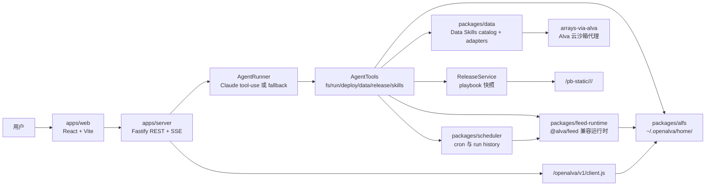
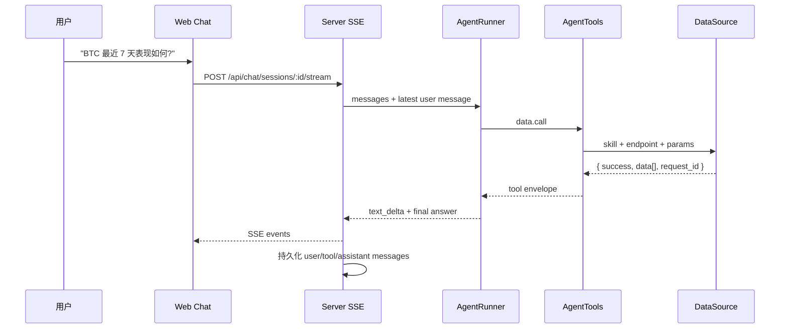
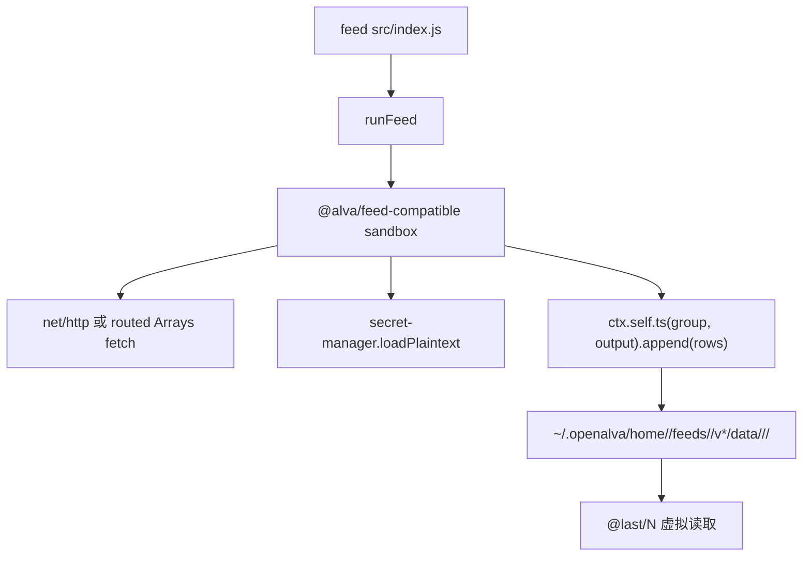
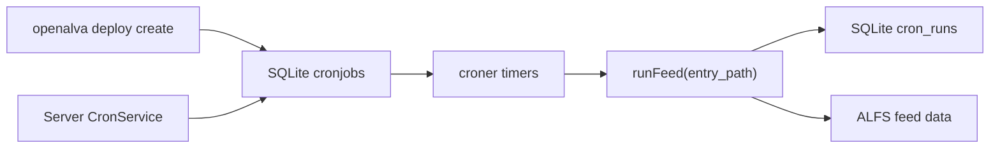
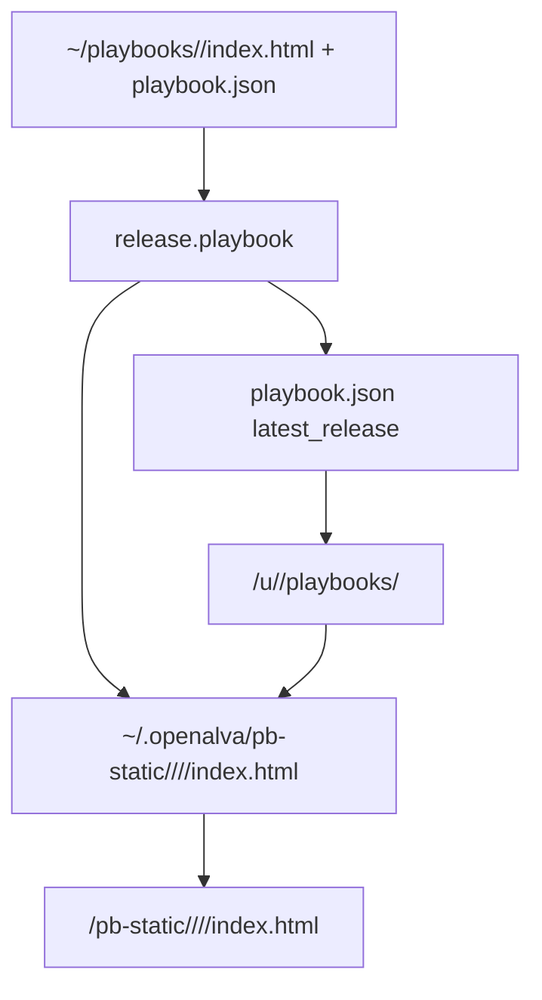

# OpenAlva

[English](./README.en.md) | 中文

OpenAlva 是一个 local-first 的开源金融 agent 系统，目标是复刻 alva.ai 的核心产品形态：用户通过网页对话驱动 AI agent 获取实时金融数据、构建持续运行的 feed 数据管线、发布版本化 playbook 页面，并把所有产物保存在自己的本地机器上。

它不是 Claude Code 或 Codex 的套壳。Claude Code / Codex 是面向代码仓库的通用 coding agent；OpenAlva 是一个完整的金融工作流应用运行时。模型只是其中一个可替换组件，系统本身还包含 Web UI、ALFS 文件系统、feed runtime、数据源适配层、调度器、release 系统和浏览器 SDK。

> 当前状态：Phase 0-2 已完成；Phase 3 的 Chat/Agent 主链路部分完成；Phase 4 已有最小发布面。MVP 闭环尚未完成，仍待补 screenshot/lint 门禁、Explore 门户、chart artifact、完整 blueprint 加载、Portfolio-Watch 种子 playbook、Altra-lite、Remix 和 native 数据驱动。

## 项目为什么存在

Alva 的核心价值不是单次问答，而是一个更完整的投资工作流：

1. 用户向 agent 提问或描述想要监控的市场/资产。
2. agent 必须实时取数，而不是用模型记忆编造行情。
3. 如果这个需求需要长期运行，agent 会生成 feed 代码和 playbook。
4. feed 按 cron 定时刷新，把数据追加到本地数据目录。
5. 发布后的 HTML playbook 读取最新 feed 数据，成为一个可长期打开的本地仪表盘。
6. 未来还可以 remix、改阈值、换标的、复用血缘。

OpenAlva 把这套产品形态放回用户自己手里：

- 文件和数据保存在 `~/.openalva`。
- 单机即可运行。
- 数据源适配器可逐步替换。
- LLM 后端可替换。
- playbook 是本地文件和静态快照，不是平台里的黑盒状态。

## 总体架构



### Monorepo 结构

```text
apps/server
  Fastify 服务端：health、design-system 静态资源、chat SSE、tools API、
  playbook live/static 路由、最小浏览器 SDK。

apps/web
  React + Vite 宿主界面：Sidebar、Chat 页面、会话列表、SSE 解析、
  工具执行卡片、模型选择器占位。

packages/alfs
  本地 ALFS 兼容文件系统层。把 ~/... 解析到
  ~/.openalva/home/<user>/...，支持 @last/N 虚拟读取、时间序列桶、
  @kv 和单机 grant stub。

packages/feed-runtime
  @alva/feed 兼容运行时。执行 feed 脚本，暴露白名单模块，
  通过 ALFS time-series API 写 feed 输出。

packages/scheduler
  cron 存储与执行服务，支持 deploy create/list/get/pause/resume/
  delete/trigger/runs。

packages/data
  Data Skills 镜像目录与 DataSource 适配器。目前 P0 适配器是
  arrays-via-alva：通过 Alva 云沙箱执行 fetch 代码，以便在本地不保存
  真实 Arrays JWT 的情况下访问 public endpoint。

packages/cli
  openalva CLI 子集，覆盖 fs、run、deploy 等调试入口。

vendor/design-system
  vendored Alva design tokens、design-system CSS 与 design contract。
```

## 和 Claude Code / Codex 的异同

Claude Code 和 Codex 是通用 coding agent。它们面向代码仓库，负责读代码、改代码、跑命令、提交 PR。

OpenAlva 是一个垂直领域应用。它内部使用 agent，但它本身不是 coding agent。

| 维度 | Claude Code / Codex | OpenAlva |
|---|---|---|
| 主要目标 | 修改或理解代码 | 构建和运行金融工作流 |
| 主界面 | CLI / 编辑器 / 仓库 chat | 自建 Web UI、Chat、Playbook、Release |
| 持久化对象 | Git 文件、工作区、提交 | ALFS home tree、feed 数据、SQLite 元数据、release 快照 |
| 工具面 | shell、文件编辑、测试、仓库操作 | `fs`、`run`、`deploy`、`data.call`、`release`、skills、浏览器 SDK |
| 运行产物 | 代码变更、commit、PR | 定时刷新的数据管线和 localhost playbook 页面 |
| 数据策略 | 取决于具体开发任务 | 金融事实必须通过工具实时取数，禁止模型记忆编造 |
| UX 目标 | 开发者工作流 | 投资者 / builder 工作流 |
| agent 的角色 | 产品本体 | 产品内部的一个可替换组件 |

一句话：Codex 可以帮助开发 OpenAlva；OpenAlva 则是面向投资工作流的本地运行时。

## 核心数据流转逻辑

### 1. 一次性市场问答



任何市场敏感问题都应该走 `data.call` 或其他相关工具。当前价格、涨跌幅、利率、新闻、财报、链上指标等事实不应该由模型凭记忆回答。

### 2. Feed 执行



关键语义：

- `ts(group, output).append(rows)` 对同一个 `date` 桶执行整桶 replace。
- 不同 `date` 桶共存。
- `@last/N` 按 bucket date 读取最新 N 条。
- feed `data/` 目录禁止任意 `writeFile`，必须通过 Feed SDK 写入。
- 上游返回的时间戳格式会如实保留，不做“贴心归一化”。

### 3. 定时部署



deploy 操作同时暴露给 CLI 和 agent tools：

- `deploy.create`
- `deploy.list`
- `deploy.get`
- `deploy.pause`
- `deploy.resume`
- `deploy.delete`
- `deploy.trigger`
- `deploy.runs`

### 4. Playbook 发布



当前 release 实现仍是最小版本：

- `release.playbookDraft` 创建或更新 draft 目录与 `playbook.json`。
- `release.playbook` 把 `index.html` 复制到不可变版本快照。
- `/u/<user>/playbooks/<name>` 服务最新 release。
- `/pb-static/<user>/<name>/<version>/index.html` 服务指定版本快照。
- `/openalva/v1/client.js` 暴露最小浏览器 SDK：

```js
const client = new OpenAlva.Client();
const rowsJson = await client.fs.read({ path: "~/feeds/example/v1/data/watch/assets/@last/50" });
```

feed 绑定校验、截图验证、design lint 和更完整的 release metadata 仍待实现。

## Agent 工具体系

OpenAlva 的工具面刻意对齐 Alva CLI / 平台动词，方便复用官方 skill、blueprint 和 reference 文档。

已实现或部分实现：

- `fs.read`
- `fs.write`
- `fs.readdir`
- `fs.stat`
- `fs.mkdir`
- `fs.grant`
- `run`
- `deploy.create`
- `deploy.list`
- `deploy.get`
- `deploy.pause`
- `deploy.resume`
- `deploy.delete`
- `deploy.trigger`
- `deploy.runs`
- `data.call`
- `skills.list`
- `skills.get`
- `release.playbookDraft`
- `release.playbook`

仍待实现：

- `screenshot`
- 完整 blueprint / reference skill 加载
- chart artifact 生成
- design lint 门禁
- 更完整的 release 与 Explore 集成

## 数据层

数据层拆成三部分：catalog、routing、adapter。

### Catalog

`packages/data/catalog/` 镜像 Alva Data Skills：

- 19 个 skill
- 111 个 endpoint
- public / pro-gated 元数据
- endpoint markdown 文档，供 agent 路由时按需读取

这样即使本地 native driver 尚未全部完成，agent 也已经拥有与 Alva 兼容的数据世界观。

### P0 Adapter: arrays-via-alva

当前 public 数据适配器是 `arrays-via-alva`：

1. OpenAlva 为目标 Arrays endpoint 生成一段很小的 fetch 脚本。
2. 这段脚本通过 `alva run` 发到 Alva 云沙箱执行。
3. 真实 `ARRAYS_JWT` 留在 Alva 云沙箱 secrets 中。
4. 本地从 logs 里解析 sentinel JSON payload。
5. public endpoint 返回统一 `{ success, data[], request_id }`。

本地 `ARRAYS_JWT` 只播种占位值 `routed-via-alva`，不是凭证。它只用于让 Alva 风格 feed 里 `secret.loadPlaintext("ARRAYS_JWT")` 的本地守卫通过；真正请求时路由层会丢弃占位值，依赖云端凭证。

### 后续 Native Drivers

长期目标是逐步替换代理路径：

- Binance
- Hyperliquid
- yfinance 或直接行情源
- FRED
- Polymarket
- SEC EDGAR
- RSS / news sources

## 设计原则

### 1. Local-first，但保留平台形状

OpenAlva 优先单机自用，但路径和数据模型保留平台化结构：

```text
~/.openalva/
  openalva.db
  secrets.json
  home/<user>/
    feeds/
    playbooks/
    memory/
  pb-static/<user>/<playbook>/<version>/
```

这样未来如果要做多用户或公网托管，不需要推翻核心路径。

### 2. 文件是真相

SQLite 保存元数据、索引、chat messages、cron jobs、run logs。Playbook、feed scripts、feed data、README 和 release snapshots 都是真实文件。

### 3. 市场事实必须取数

agent 不能凭模型记忆回答当前金融事实。只要问题涉及价格、利率、行情指标、新闻、财报、链上数据，就应该通过工具取数。

### 4. Alva 兼容优先于重新发明

OpenAlva 刻意镜像 Alva 概念：

- ALFS 风格路径
- `@alva/feed` 风格 API
- Data Skills catalog
- deploy / release 动词
- playbook snapshots
- design tokens 与 hosted shell 边界

目标是最大化复用官方 Alva blueprint / reference，而不是发明另一套平台心智模型。

### 5. 分层可替换

系统按可替换层设计：

- Anthropic today, another model later.
- `arrays-via-alva` today, native data drivers later.
- Local cron today, hosted scheduler later.
- Local static serving today, public deployment later.

## 实现原理

### Server

`apps/server` 使用 Fastify，目前提供：

- `GET /health`
- `GET /design-system/v1/*`
- `GET /api/tools`
- `POST /api/tools/:name`
- `GET /api/chat/sessions`
- `POST /api/chat/sessions`
- `GET /api/chat/sessions/:id/messages`
- `POST /api/chat/sessions/:id/stream`
- `GET /openalva/v1/client.js`
- `GET /pb-static/*`
- `GET /u/:user/playbooks/:name`

Chat streaming 使用 Server-Sent Events：

- `session`
- `text_delta`
- `tool_start`
- `tool_result`
- `message`
- `done`
- `error`

### Agent

`AgentRunner` 有两种模式：

- 如果配置了 `ANTHROPIC_API_KEY`，使用 Anthropic Messages API 和 tool-use schema。
- 如果没有 key，则使用本地 deterministic fallback，覆盖少量关键路径，例如 BTC 数据问答和 playbook ask-first 行为。

Anthropic 的工具名不能包含点号，所以 OpenAlva 会把 `data.call` 映射成 `data__call` 传给模型 API，执行前再映射回原始工具名。

### Feed Runtime

`packages/feed-runtime` 实现当前测试和参考 playbook 所需的 `@alva/feed` 子集：

- `Feed`
- `feedPath`
- `makeDoc`
- primitive field helpers
- `feed.def`
- `ctx.self.ts(...).append(...)`
- `ctx.kv`
- 白名单 `net/http`
- `secret-manager.loadPlaintext`

项目已经从最初的进程内 VM 信任模型，升级到一次性子进程隔离方向。设计目标是 feed 代码即使出错或逃逸，也不应该影响长期运行的 server 进程。

### Web

`apps/web` 是宿主 UI，不是 playbook UI。它提供：

- 深色 sidebar
- 会话列表
- chat thread
- SSE stream parsing
- tool execution cards
- composer
- 静态模型选择器控件

Playbook HTML 是另一类 artifact，通过 release routes 单独服务。

## 当前进度

已实现：

- Monorepo foundation
- TypeScript、ESLint、Vitest
- vendored design-system assets
- ALFS init 与 path resolution
- time-series feed storage 与 virtual reads
- feed runtime
- scheduler 与 run history
- CLI subset
- mirrored Data Skills catalog
- arrays-via-alva data adapter
- chat session storage
- agent tool registry
- Claude tool-use foundation
- React chat UI
- minimal release/publish routes
- minimal browser SDK

未完成：

- screenshot verification
- design lint gate
- Explore portal
- chart artifacts
- full blueprint/reference skill loading
- Portfolio-Watch seed workflows
- UDF invocation
- notification channels
- Altra-lite backtesting engine
- Remix workflow
- native data drivers

## 本地运行

依赖：

- Node.js 20+
- pnpm 11+
- 可选：`ANTHROPIC_API_KEY`
- 如需 live Arrays proxy：本地有已认证的 `alva` CLI

安装：

```bash
pnpm install
```

运行检查：

```bash
pnpm check
```

构建 Web：

```bash
pnpm build:web
```

启动 server：

```bash
pnpm dev:server
```

打开：

```text
http://127.0.0.1:4700
```

server 首次启动会初始化 `~/.openalva`。

## CLI 示例

读取文件：

```bash
pnpm openalva fs read --path '~/memory/example.json'
```

运行内联 feed code：

```bash
pnpm openalva run --code 'console.log("hello from OpenAlva")'
```

创建定时 deploy：

```bash
pnpm openalva deploy create \
  --name btc-watch \
  --path '~/feeds/btc-watch/v1/src/index.js' \
  --cron '0 * * * *'
```

手动触发：

```bash
pnpm openalva deploy trigger --id 1
```

## 开发哲学

OpenAlva 按从底向上的顺序构建：

1. 先复刻平台原语：filesystem、feed runtime、scheduler、data tools。
2. 再加入 agent 与 host UI。
3. 再闭合用户可见链路：publish、screenshot、Explore、seed playbooks。
4. 最后补更深的平台能力：Altra-lite、Remix、native data drivers、notifications、workspace tabs。

核心约束是：每个看起来很酷的 UI 功能，都应该落在真实的本地运行时原语上。UI 里出现的 playbook 应该对应真实文件；屏幕上的数据应该能追溯到 feed 或 tool call；发布出去的页面应该有不可变快照。

